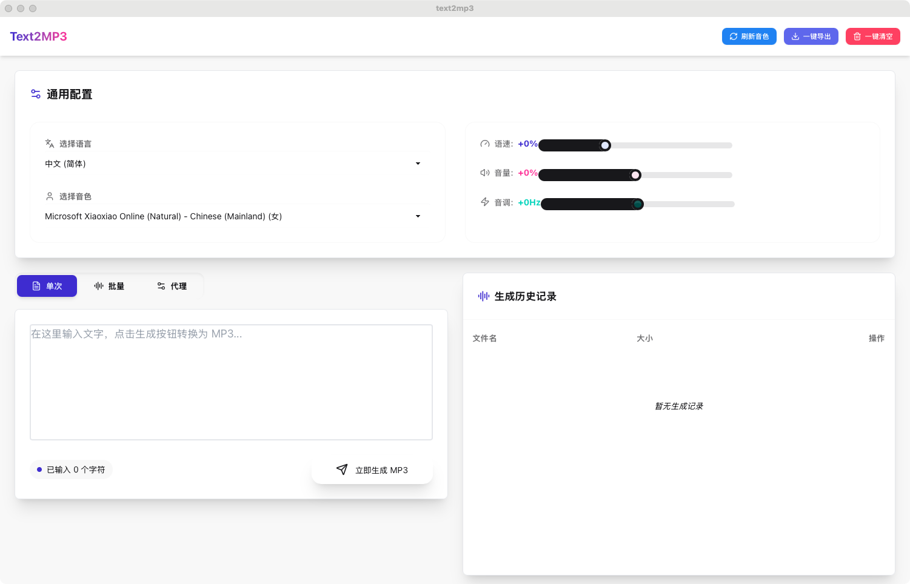

# Text2MP3 - 文本转 MP3 工具

基于 Edge TTS 的跨平台文本转语音工具，使用 Tauri + React + DaisyUI 构建。



## 功能特性

- **单次生成**：输入文本一键生成 MP3 文件
- **批量生成**：多行文本批量转换为多个 MP3 文件
- **多语言支持**：支持中文、英语、日语、韩语等多种语言
- **音色选择**：丰富的音色库，男声、女声任意选择
- **参数调节**：
  - 语速调整（-50% 到 +100%）
  - 音量调整（-50% 到 +50%）
  - 音调调整（-20Hz 到 +20Hz）
- **跨平台**：支持 Windows、macOS、Linux

## 技术栈

- **前端**：React 19 + TypeScript + DaisyUI + Tailwind CSS
- **后端**：Rust + Tauri 2
- **TTS 引擎**：Microsoft Edge TTS API
- **通信**：WebSocket (tokio-tungstenite)

## 开发环境要求

- Node.js 18+
- Rust 1.70+
- pnpm / npm / yarn

## 安装与运行

### 1. 安装依赖

```bash
# 安装前端依赖
npm install

# 安装 Tauri CLI（如果未安装）
npm install -g @tauri-apps/cli
```

### 2. 开发模式运行

```bash
npm run tauri dev
```

### 3. 构建生产版本

```bash
npm run tauri build
```

构建完成后，可执行文件将生成在 \`src-tauri/target/release/\` 目录下。

## 使用说明

### 单次生成

1. 选择语言和音色
2. 调整语速、音量、音调（可选）
3. 在文本框中输入要转换的文本
4. 点击"生成 MP3"按钮
5. 选择保存位置即可

### 批量生成

1. 选择语言和音色
2. 调整语速、音量、音调（可选）
3. 切换到"批量生成"标签页
4. 在文本框中每行输入一条文本
5. 点击"批量生成 MP3"按钮
6. 选择保存目录，文件将自动命名为 \`audio_1.mp3\`、\`audio_2.mp3\` 等

## 项目结构

```
text2mp3/
├── src/                    # React 前端源码
│   ├── App.tsx            # 主应用组件
│   ├── App.css            # 样式文件
│   └── main.tsx           # 入口文件
├── src-tauri/             # Rust 后端源码
│   ├── src/
│   │   ├── edge_tts.rs    # Edge TTS 核心模块
│   │   ├── lib.rs         # Tauri 命令处理
│   │   └── main.rs        # 应用入口
│   └── Cargo.toml         # Rust 依赖配置
├── package.json           # Node.js 依赖配置
└── tailwind.config.js     # Tailwind 配置
```

## 核心功能实现

### Edge TTS 集成

项目使用 Microsoft Edge TTS 的 WebSocket API，通过以下步骤实现文本转语音：

1. 建立 WebSocket 连接到 Edge TTS 服务器
2. 发送配置消息（音频格式：MP3 24kHz 48kbps）
3. 发送 SSML 格式的文本和语音参数
4. 接收并保存音频数据

### Tauri 命令

- \`fetch_voices\`：获取可用的音色列表
- \`generate_speech\`：生成单个 MP3 文件
- \`batch_generate_speech\`：批量生成多个 MP3 文件

## 常见问题

**Q: 为什么有些音色不可用？**
A: 音色列表由 Microsoft 服务器返回，某些音色可能在特定地区不可用。

**Q: 生成的音频质量如何？**
A: 默认使用 MP3 格式，24kHz 采样率，48kbps 比特率，适合大多数使用场景。

**Q: 是否需要网络连接？**
A: 是的，需要连接到 Microsoft Edge TTS 服务器，因此必须有可用的网络连接。

## 许可证

MIT License

## 致谢

- [Microsoft Edge TTS](https://azure.microsoft.com/en-us/services/cognitive-services/text-to-speech/)
- [Tauri](https://tauri.app/)
- [React](https://react.dev/)
- [DaisyUI](https://daisyui.com/)
